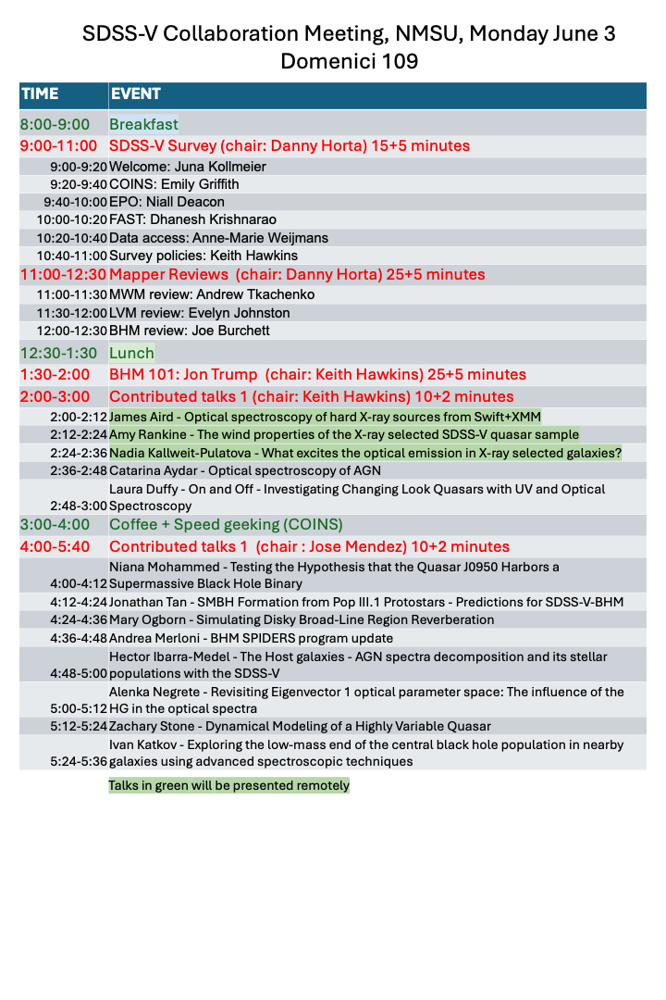
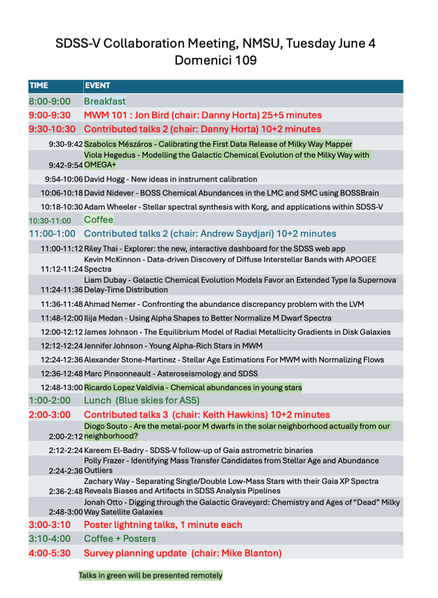
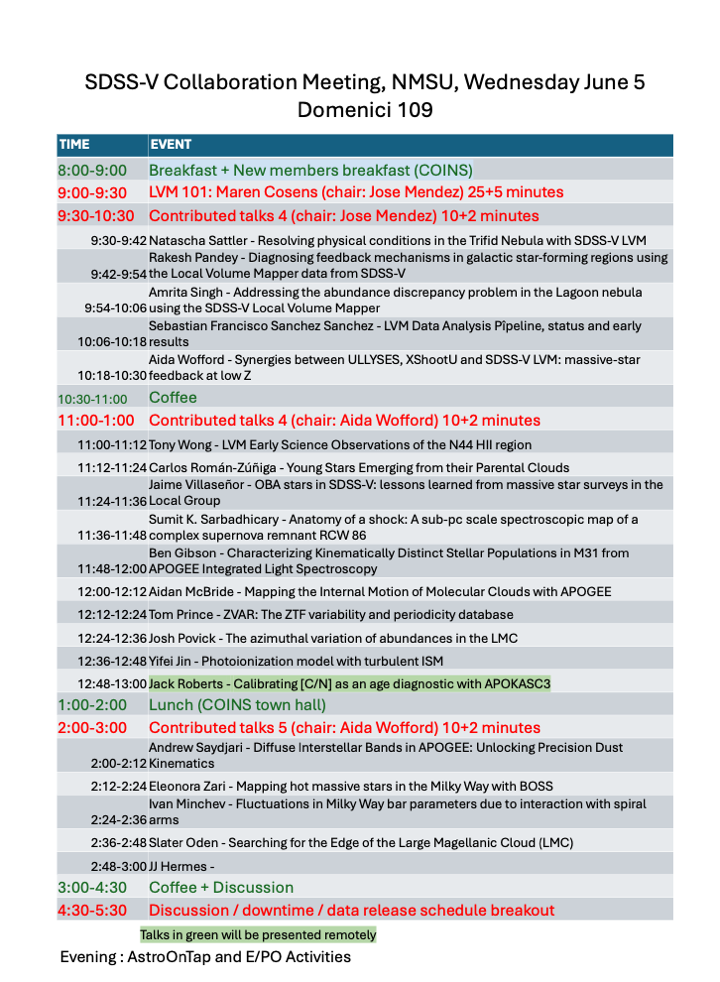

---
# Feel free to add content and custom Front Matter to this file.
# To modify the layout, see https://jekyllrb.com/docs/themes/#overriding-theme-defaults

layout: page
title : Agenda
---
The meeting will consist of plenary and parallel talks on June 3-5 in Domenici Hall on
the NMSU campus.  June 6-7 will feature breakout sessions by Mapper in the same building.
On Thursday afternoon (June 6), we will lead a visit to Apache Point Observatory; there is a limited capacity of 70 visitors on the APO trip, and registrants should indicate their interest in the trip at the time of registration.  

A full agenda can be found [here](https://docs.google.com/spreadsheets/d/1hBucktEvI5ya6K9_AX7t7OdvjikRbjatp73UfvGhyho/edit#gid=0).  

