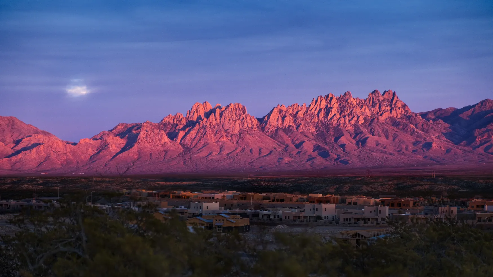

---
# Feel free to add content and custom Front Matter to this file.
# To modify the layout, see https://jekyllrb.com/docs/themes/#overriding-theme-defaults

layout: page
title : Travel/Accommodations
---

## Air travel

[El Paso International](https://www.elpasointernationalairport.com/) (ELP) is the nearest airport, about 1 hour drive from Las Cruces, and is recommended for getting to the area. 

## Getting to Las Cruces from ELP

We recommend the [Las Cruces Shuttle](https://www.lascrucesshuttle.com/) service for transportation from/to the airport.  Attendees should book their shuttle as soon as possible after booking flights.  The shuttle will run at least 9 trips on Sunday, June 2nd, but can possibly run a few more according to demand.

Please use the [Rides and Roommates wiki page](https://sdss-wiki.atlassian.net/wiki/spaces/SDSS/pages/13343233/2024+SDSS-V+Collaboration+Meeting+Rides+and+Roommates)
for coordinating rides to/from the airport.  If we know multiple people are coming in on the same flight, we can work to see if Las Cruces
Shuttle can run a special dedicated van!

The El Paso airport contains a full suite of rental car options, and carpooling is strongly encouraged if attendees opt for this mode of transport.  

Rideshare services Lyft and Uber are usually available but can get pricey going to/from the airport depending on time of day, surge pricing, etc. 

## Hotels
We have reserved blocks of rooms at the following hotel.  When booking, please use the link below to ensure you get the negotiated rate:

[Courtyard by Marriott](https://www.marriott.com/en-us/hotels/lrucy-courtyard-las-cruces-at-nmsu/overview/?gclid=CjwKCAjw17qvBhBrEiwA1rU9w0UDkVMhZ-MAGEQMa5bPcXqNfFPqzx9zlDVzMyVJjpsyCU0F_69PhhoCkHEQAvD_BwE&gclsrc=aw.ds&cid=PAI_GLB0004YXD_GLE000BIM5_GLF000OETA)  
Located one block from the NMSU campus, the Courtyard by Marriott, is 1.1 miles from the meeting venue (Domenici Hall on the NMSU campus).  We have reserved a block of rooms at the special rate of $129/night.  Attendees may book one of three ways:
1. Call the hotel at (575) 526-1722, press 1 for reservations or press 3 to be connected to the front desk. Ask to make a reservation under “Sloan Digital Sky”
2. Use Marriott mobile app on your phone and add the Group Code Government: SDSSDSA or SDSSDSB
3. Click this direct reservation link: [https://www.marriott.com/events/start.mi?id=1707782737466&key=GRP](https://www.marriott.com/events/start.mi?id=1707782737466&key=GRP)

Other possible hotels include:

[Ramada by Wyndham](https://www.wyndhamhotels.com/ramada/las-cruces-new-mexico/ramada-palms-de-las-cruces/overview?iata=00093763&cid=PS:m43fqonek2xcfri&gad_source=1&gclid=CjwKCAjwl4yyBhAgEiwADSEjePr5ix-OIaqHBA1E4KC_T7rjHe1rEwhOUHjTbDtK2dv7oyGokUY5WxoCxvIQAvD_BwE&gclsrc=aw.ds)

[Comfort Suites University](https://www.choicehotels.com/new-mexico/las-cruces/comfort-suites-hotels/nm003)

[Sleep Inn University](https://www.choicehotels.com/new-mexico/las-cruces/sleep-inn-hotels/nm008)

[Hilton Garden Inn](https://www.hilton.com/en/hotels/lrulcgi-hilton-garden-inn-las-cruces/)  

If you are interesting in sharing lodging, you may use the [Rides and Roommates wiki page](https://sdss-wiki.atlassian.net/wiki/spaces/SDSS/pages/13343233/2024+SDSS-V+Collaboration+Meeting+Rides+and+Roommates) 
to try to identify roommates.

